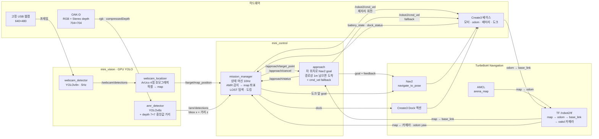
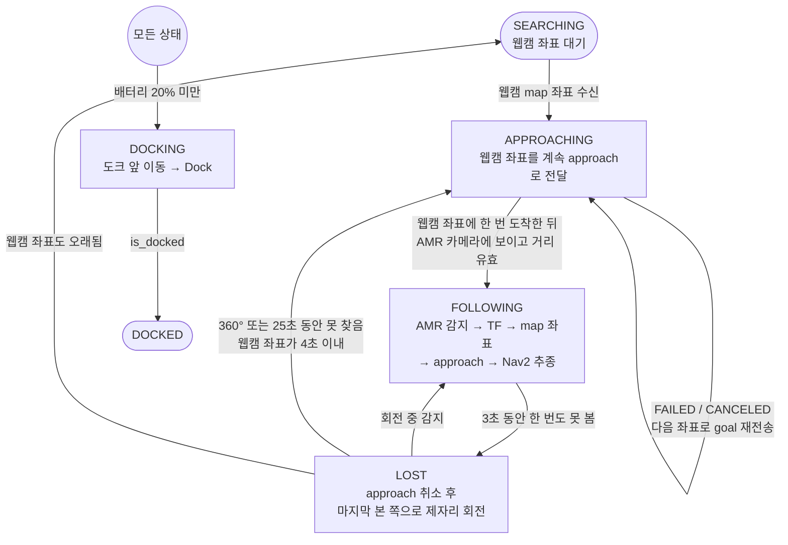
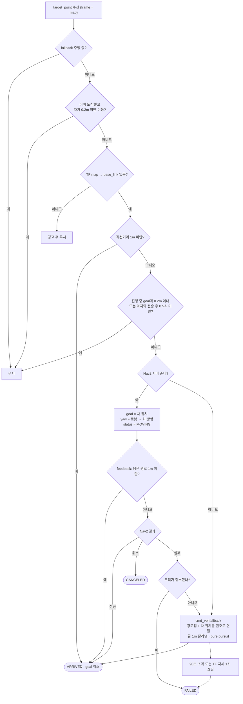
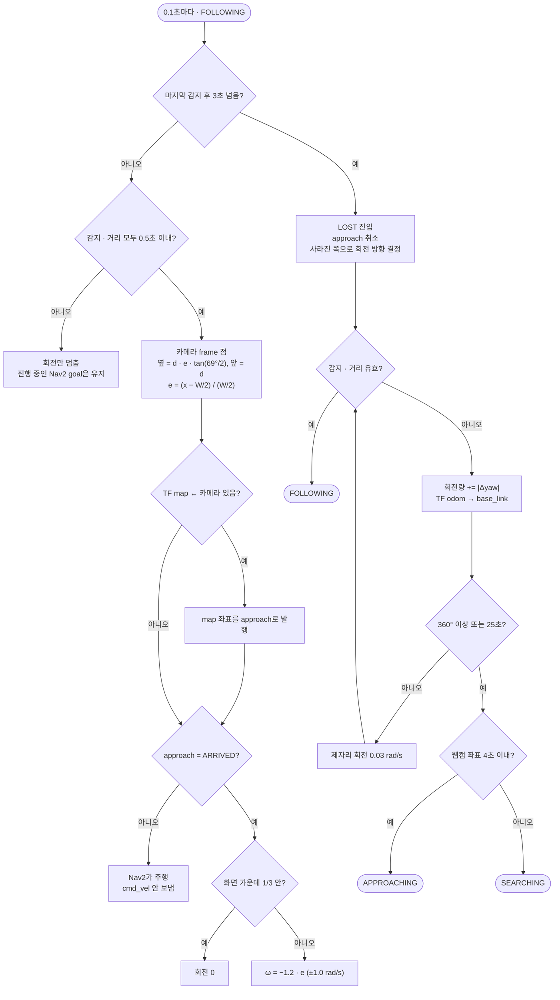
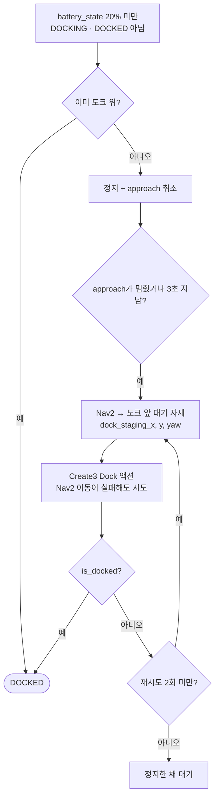
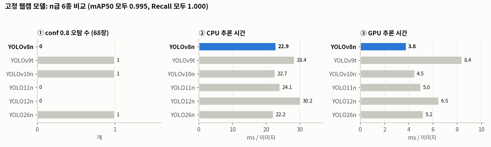
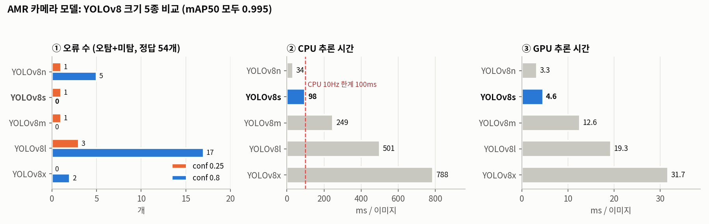
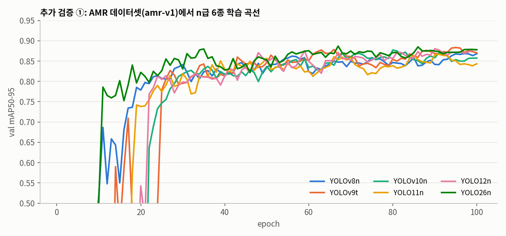
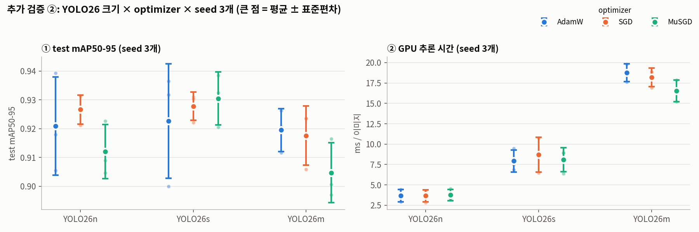

# 미니카를 감지하고 추적하는 프로젝트

## 구성

| 패키지 | 노드 | 역할 |
|---|---|---|
| mini_vision | `webcam_detector` | 고정 웹캠 YOLO 감지 → `/webcam/detections` |
| mini_vision | `webcam_localizer` | 웹캠 픽셀 → map 좌표 → `/target/map_position` |
| mini_vision | `amr_detector` | TurtleBot4 OAK-D YOLO 감지 + depth 거리 → `/amr/detections` |
| mini_control | `approach` | 목표 좌표로 Nav2 이동 → `/approach/status` |
| mini_control | `mission_manager` | 상태 전환 및 자동차 추종 → `/robot2/cmd_vel` |

상태 흐름: `SEARCHING → APPROACHING → FOLLOWING ⇄ LOST` (LOST에서 못 찾으면 `APPROACHING`/`SEARCHING`)

- 웹캠이 자동차를 찾으면 자동차 map 좌표를 approach로 넘긴다 (APPROACHING). 자동차가 움직이면 좌표를 계속 넘긴다.
- approach는 **자동차 위치 자체를 Nav2 goal**로 보내고, feedback의 경로상 남은 거리가 `standoff_distance`(1m) 아래가 되면 goal을 취소하고 `ARRIVED`를 알린다. 로봇 위치는 TF(`map → base_link`)로 구한다.
- 웹캠 좌표에 한 번 도착한 뒤 AMR 카메라에 자동차가 보이면 FOLLOWING으로 간다 (도착 전에는 보여도 접근을 계속한다).
- FOLLOWING: bbox 가로 위치(화각 69°) + depth 거리로 카메라 frame 점을 만들고, TF로 map 좌표로 바꿔 approach로 넘긴다 → 추종 중에도 Nav2가 장애물을 피한다. standoff 안이면 제자리 회전으로 자동차를 화면 가운데에 둔다.
- `lost_timeout`(3초) 동안 못 보면 approach를 취소하고 마지막으로 본 쪽으로 360도 회전한다 (LOST). 보이면 FOLLOWING, 한 바퀴 돌아도 없으면 웹캠 좌표로 다시 접근한다.
- 추종 거리는 `amr_detector`가 `/amr/detections`의 `results[0].pose.pose.position.z`에 넣어 준 depth 거리를 쓴다.

## 시스템 아키텍처

노드 5개와 TurtleBot4 스택이 표준 메시지 토픽과 TF로 연결된다. 새 메시지 타입은 없다.
TurtleBot4의 TF는 `/robot2/tf`로 나오므로 launch에서 `/tf`, `/tf_static`을 리매핑한다.



## 플로우차트

### 전체 상태 머신

`mission_manager`가 10Hz로 상태를 바꾼다. 접근과 추종 모두 approach → Nav2로 움직이고, mission_manager는 Nav2가 멈춰 있을 때(ARRIVED, LOST)만 제자리 회전 명령을 보낸다.



### 접근 (`approach`)

goal은 차 위치 자체로 보내고, Nav2 feedback의 남은 경로 길이로 도착을 판정한다. 로봇과 차 사이에 벽이 있어도 Nav2가 돌아가는 경로를 만든다.



### 추종과 LOST 탐색 (`mission_manager`)



### 배터리 도킹



## YOLO 모델 선정

카메라마다 보는 장면이 달라 데이터셋과 모델을 따로 골랐다. 클래스는 둘 다 `car`, `dummy` 2개이고, 토픽에는 `car`만 싣는다.

| 노드 | 가중치 | 모델 | 데이터셋 (train / valid / test) | 추론 장치 · conf |
|---|---|---|---|---|
| `webcam_detector` | `models/webcam_best.pt` | **YOLOv8n** | `my_dataset_webcam` (160 / 45 / 23) | GPU · 0.8 |
| `amr_detector` | `models/amr_best.pt` | **YOLOv8s** | `dataset_amr_v1` (318 / 31 / 15) | GPU · 0.8 |

- 공통 학습 조건: `epochs=100, patience=20, imgsz=640, batch=16, seed=0`, `optimizer=auto`(→ AdamW, lr 0.001667). 모델만 바꿔 같은 PC(RTX 4070 Laptop)에서 학습했다.
- 비교 지표는 수업 자료의 "KEY METRICS TO COLLECT" 9개다. 상세 표와 오탐 이미지는 [`yolo선택과정_8_26.md`](src/mini_vision/models/yolo선택과정_8_26.md)(웹캠), [`yolo선택과정_n_x.md`](src/mini_vision/models/yolo선택과정_n_x.md)(AMR)에 있다.
- 그래프는 `python3 docs/make_yolo_charts.py`로 다시 그릴 수 있다.

### 1. 정확도 지표로는 가를 수 없다

두 비교 모두 mAP50이 모든 모델에서 0.995(상한)였고, Recall은 웹캠 모델 전부 1.000, 최대 F1은 0.99 이상이었다. valid/test가 수십 장뿐이라 mAP50-95의 0.00x 차이는 의미가 없다.
그래서 **실제 사용할 conf 0.8에서의 오류(오탐·미탐) 개수**와 **추론 속도**로 골랐다.

### 2. 고정 웹캠: n급 6종 → YOLOv8n



1. **① conf 0.8 오탐**: YOLOv9t · YOLOv10n · YOLO26n은 화면 위쪽 가장자리에 걸린 로봇 본체를 car로 잡았다(신뢰도 0.81~0.89라 0.8로 못 거름). 오탐이 없는 **v8n · 11n · 12n**만 남긴다.
2. **② CPU 속도**: 셋 다 100ms 안이지만 v8n 22.9ms < 11n 24.1ms < 12n 30.2ms.
3. **③ GPU 속도**: v8n이 3.8ms로 6종 중 가장 빠르다. GFLOPs가 가장 낮은 YOLO26n(5.9)보다도 빨라, 연산량과 실제 속도가 일치하지 않았다.
4. → **YOLOv8n 선정.** 학습 시간도 1분 32초로 가장 짧았다. 차순위는 YOLO11n.

### 3. AMR 카메라: YOLOv8 n · s · m · l · x → YOLOv8s



1. **① 오류 수**: conf 0.8에서 **s와 m만 오류 0개**다. n은 정답 4개를 놓치고 신뢰도 0.82짜리 오탐 1개를 냈고, l은 신뢰도가 전반적으로 낮아 정답 17개를 놓쳤다. conf 0.25에서 s의 오탐(신뢰도 0.29, 붉은 밑창 신발)은 임계값으로 걸러진다.
2. **② CPU 속도**: m은 249ms로 CPU 10Hz(100ms)를 지킬 수 없다. s는 98ms로 한계에 걸친다.
3. **③ GPU 속도**: GPU로 돌리기로 해서 s는 4.6ms로 충분하다. 같은 오류 0개인 m(12.6ms)보다 약 2.7배 빠르고 모델도 작다.
4. → **YOLOv8s 선정.** m · l · x는 이 데이터 규모에서 정확도 이득 없이 느리기만 했다.

### 4. 추가 검증: 더 새로운 모델과 다른 optimizer도 차이가 없는가

선정 후 `yolo_compare/`에서 Roboflow AMR 데이터셋(`amr-5qizb` v1)으로 한 번 더 확인했다(`train_compare.py`, `train_sweep.py`, 이 PC에서 측정).



- n급 6종 모두 epoch 40 이후 val mAP50-95 0.85~0.89에 모인다. best.pt 기준 0.867(11n) ~ 0.888(26n)로 0.02 차이이고, GPU 추론은 2.8~4.4ms다.
- 수렴 속도만 다르다. v8n과 26n은 epoch 10부터 0.5를 넘고, 나머지 4종은 epoch 18~25가 되어야 넘는다.



- YOLO26 n · s · m × AdamW · SGD · MuSGD를 seed 3개씩 27번 학습했다.
- **① seed만 바꿔도 test mAP50-95가 ±0.005~0.02 흔들린다.** 크기나 optimizer에 따른 평균 차이(0.905~0.931)가 이 흔들림 안에 들어가, 어느 조합도 확실히 낫다고 할 수 없다.
- **② 속도는 크기에 정확히 비례한다.** n 약 3.7ms → s 약 8ms → m 약 17~19ms.
- → 정확도는 데이터 규모가 상한을 정하고, 모델 계열·크기·optimizer는 속도만 바꾼다. 그래서 **오류 개수와 속도로 고른 YOLOv8n / YOLOv8s를 유지**했다.

### 5. 한계

- **평가 표본이 작다.** 웹캠 test 23장(정답 30개), AMR test 15장(정답 15개)이라 오류 1개가 순위를 바꿀 수 있다. valid는 best.pt 선택에도 쓰여 약간 낙관적이다.
- **웹캠 학습 이미지는 1280×720인데 실제 카메라는 640×480**이다. 새로 찍은 640×480 영상으로 최종 확인이 필요하다.
- 속도는 학습 PC 기준이다. 로봇·다른 PC에서는 달라질 수 있다.

## 통합 테스트

기준: `~/minicar_ws`, ROS 2 Jazzy, 로봇 namespace `/robot2`

### 1. 빌드

```bash
cd ~/minicar_ws
source /opt/ros/jazzy/setup.bash
colcon build --symlink-install --packages-select mini_vision mini_control
source install/setup.bash
```

새 터미널을 열 때마다 `source ~/minicar_ws/install/setup.bash`를 먼저 실행한다.

### 2. TurtleBot4 위치 추정 + Nav2 + RViz

`system.launch.py`가 위치 추정(`localization.launch.py`), Nav2(`nav2.launch.py`), RViz(`view_navigation.launch.py`)를 같이 실행한다.
맵은 `mini_control/maps/arena_map.yaml`, Nav2 파라미터는 `mini_control/config/nav2.yaml`(TurtleBot4 기본값에서 global costmap `inflation_radius`만 0.05로 변경)을 쓴다.

launch 후 RViz에서 "2D Pose Estimate"로 초기 위치를 지정해야 `map → base_link` TF가 나오고 approach가 동작한다.

비전/제어 노드만 다시 띄울 때 초기 위치를 매번 다시 잡지 않으려면, 위치 추정·Nav2·RViz를 따로 띄워 두고 system.launch에서는 끈다.

```bash
# 각각 별도 터미널에서: 위치 추정 / Nav2 / RViz
ros2 launch turtlebot4_navigation localization.launch.py namespace:=/robot2 map:=$HOME/minicar_ws/src/mini_control/maps/arena_map.yaml
ros2 launch turtlebot4_navigation nav2.launch.py namespace:=/robot2 params_file:=$HOME/minicar_ws/src/mini_control/config/nav2.yaml
ros2 launch turtlebot4_viz view_navigation.launch.py namespace:=/robot2

# 그다음 터미널: 나머지 노드
ros2 launch mini_control system.launch.py use_localization:=false use_nav2:=false use_rviz:=false
```

필요한 토픽 확인:

```bash
ros2 topic hz /robot2/oakd/rgb/image_raw/compressed
ros2 topic hz /robot2/oakd/stereo/image_raw/compressedDepth
ros2 topic echo --once /robot2/amcl_pose
```

### 3. 전체 시스템 실행

```bash
ros2 launch mini_control system.launch.py
```

인자 변경 예:

```bash
ros2 launch mini_control system.launch.py camera_index:=0 standoff_distance:=1.0
```

| 인자 | 기본값 | 설명 |
|---|---|---|
| `namespace` | `/robot2` | 위치 추정 / Nav2 / RViz에 쓸 로봇 namespace |
| `use_localization` | `true` | 위치 추정(AMCL + map_server) 실행 여부 |
| `use_nav2` | `true` | Nav2 실행 여부 |
| `use_rviz` | `true` | RViz 실행 여부 |
| `map` | `mini_control/maps/arena_map.yaml` | 위치 추정에 쓸 맵 |
| `nav2_params_file` | `mini_control/config/nav2.yaml` | Nav2 파라미터 파일 |
| `camera_index` | `2` | 고정 웹캠 번호 (`ls /dev/video*`로 확인) |
| `amr_camera_topic` | `/robot2/oakd/rgb/image_raw/compressed` | AMR 카메라 토픽 (depth는 `stereo/image_raw/compressedDepth`, 둘 다 704x704) |
| `cmd_vel_topic` | `/robot2/cmd_vel` | 추종 속도 명령 토픽 |
| `standoff_distance` | `1.0` | 경로상 자동차까지 이 거리가 남으면 Nav2 goal 취소 [m] |
| `angular_gain` | `1.2` | 도착 후 제자리 회전 gain |
| `max_angular_speed` | `1.0` | 최대 회전 속도 [rad/s] |
| `detection_timeout` | `0.5` | 감지 결과 유효 시간 [s] |

- `amr_detector`는 감지 창을 띄우므로(`show_window: True`) 디스플레이가 있는 환경에서 실행한다.
- `mission_manager`의 `image_width`(기본 704)가 AMR 영상의 가로 폭과 같아야 방향각 계산이 맞다.
- approach / mission_manager는 TF를 쓰므로 launch에서 `/tf`, `/tf_static`을 `<namespace>/tf`로 리매핑한다.

### 4. 동작 확인

상태 전환은 launch 터미널 로그에 출력된다 (`SEARCHING -> APPROACHING` 등).

```bash
ros2 topic echo /target/map_position   # 웹캠이 계산한 자동차 위치
ros2 topic echo /approach/status       # MOVING / ARRIVED / FAILED / CANCELED
ros2 topic echo /amr/detections        # AMR 감지 결과 + 거리(results[0].pose.pose.position.z)
ros2 topic echo /robot2/cmd_vel        # 추종 속도 명령
```

### 단계별 테스트: 웹캠 없이 접근만 확인

목표 좌표를 직접 보낸다 (맵 안의 빈 곳으로 지정).

```bash
ros2 topic pub --once /target/map_position geometry_msgs/msg/PointStamped \
  "{header: {frame_id: map}, point: {x: 1.0, y: 0.5, z: 0.0}}"
```

경로상 1m 남으면 approach가 goal을 취소하고 `ARRIVED`를 알려야 정상이다 (`ros2 topic echo /approach/status`).
그 뒤 AMR 카메라에 자동차가 보이면 `APPROACHING -> FOLLOWING`으로 넘어간다.

### 정지

launch 터미널에서 `Ctrl+C`. `mission_manager`가 종료 시 정지 명령을 보낸다.

## 개별 노드로 실행

먼저 [2번](#2-turtlebot4-위치-추정--nav2--rviz)처럼 위치 추정 · Nav2 · RViz를 띄우고 RViz에서 **2D Pose Estimate**를 찍는다.
`approach`, `mission_manager`는 TF를 쓰므로 `-r /tf:=/robot2/tf -r /tf_static:=/robot2/tf_static`을 꼭 붙인다
(TurtleBot4는 TF를 `/robot2/tf`로 발행한다. 빠지면 approach가 `TF map->base_link 없음, target ignored`만 반복하고 주행하지 않는다).

terminal 1 (update camera_index) 고정 웹캠 detector
```bash
source install/setup.bash
ros2 run mini_vision webcam_detector \
  --ros-args \
  -p camera_index:=4 \
  2>&1 | tee "webcam_detector_$(date +%Y%m%d_%H%M%S).log"
```

terminal 2 웹캠 좌표 → map 좌표 localizer
```bash
source install/setup.bash
ros2 run mini_vision webcam_localizer \
  --ros-args \
  --params-file src/mini_vision/config/camera_mapping.yaml \
  2>&1 | tee "webcam_localizer_$(date +%Y%m%d_%H%M%S).log"
```

terminal 3 AMR OAK-D detector
```bash
source install/setup.bash
ros2 run mini_vision amr_detector \
  2>&1 | tee "amr_detector_$(date +%Y%m%d_%H%M%S).log"
```

terminal 4 approach
```bash
source install/setup.bash
ros2 run mini_control approach \
  --ros-args \
  --params-file src/mini_control/config/params.yaml \
  -r /tf:=/robot2/tf -r /tf_static:=/robot2/tf_static \
  2>&1 | tee "approach_$(date +%Y%m%d_%H%M%S).log"
```

terminal 5 mission manager
```bash
source install/setup.bash
ros2 run mini_control mission_manager \
  --ros-args \
  --params-file src/mini_control/config/params.yaml \
  -r /tf:=/robot2/tf -r /tf_static:=/robot2/tf_static \
  2>&1 | tee "mission_manager_$(date +%Y%m%d_%H%M%S).log"
```

TF 확인 (값이 나오면 정상, `"map" ... does not exist`면 2D Pose Estimate를 아직 안 찍은 것)
```bash
ros2 run tf2_ros tf2_echo map base_link --ros-args -r /tf:=/robot2/tf -r /tf_static:=/robot2/tf_static
```
