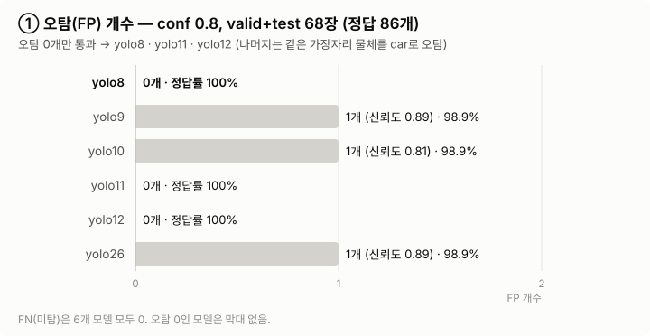
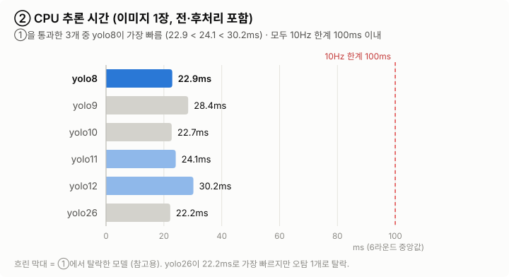
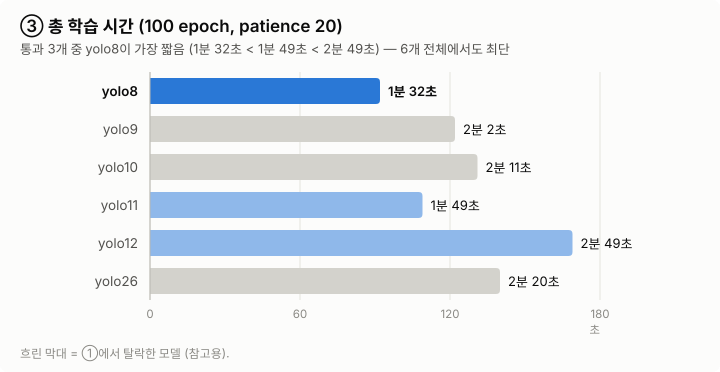
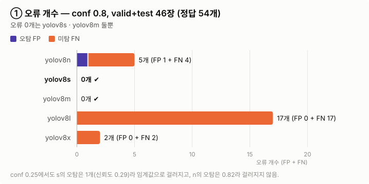
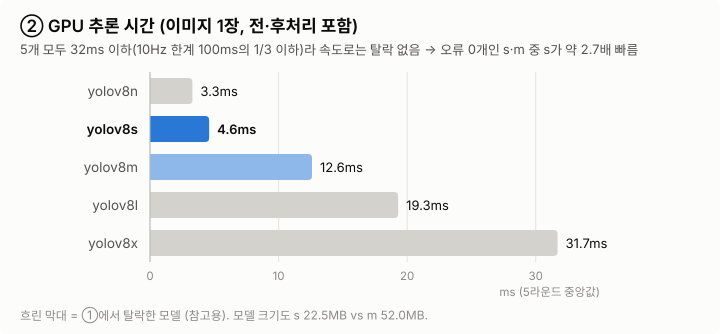

# YOLO 모델 선택 근거 정리

두 비교 실험에서 9개 지표(KEY METRICS TO COLLECT) 중 **모델을 확정한 근거가 된 지표만 그래프로** 그렸고, 나머지 지표는 **왜 판단에 쓰이지 않았는지**를 값과 함께 정리했다.

| 실험 | 원본 문서 | 데이터셋 | 확정 모델 | 결정 지표 |
|---|---|---|---|---|
| 1) n급 6종 비교 | [yolo선택과정_8_26.md](yolo선택과정_8_26.md) | `my_dataset_webcam` (웹캠) | **YOLOv8n** | 7) % Correct(오탐) → 8) CPU 속도 → 3) 학습 시간 |
| 2) YOLOv8 크기 비교 | [yolo선택과정_n_x.md](yolo선택과정_n_x.md) | `dataset_amr_v1` (AMR) | **YOLOv8s** | 7) % Correct(오류 개수) → 8) GPU 속도 |

그래프 색: **진한 파랑 = 확정 모델**, 연한 파랑 = 앞 단계를 통과한 후보, 회색 = 앞 단계에서 탈락한 모델(참고용).

---

## 1) n급 6종 비교 → YOLOv8n (웹캠)

비교 대상: yolo8(v8n) · yolo9(v9t) · yolo10(v10n) · yolo11(11n) · yolo12(12n) · yolo26(26n)
실사용 조건(`webcam_detector.py`): **CPU 추론, conf 0.8, 10Hz(프레임당 100ms)**

### 결정 근거 그래프

**① 7) % Correct Predictions — 오탐 여부 (1차 필터)**

실사용 임계값 conf 0.8에서 valid+test 68장(정답 86개)을 다시 평가했다. 오탐 없이 정답을 모두 찾은 모델은 **yolo8 · yolo11 · yolo12** 셋뿐이고, yolo9 · yolo10 · yolo26은 같은 이미지(`webcam_with_dummy_img_52`) 위쪽 가장자리의 둥근 물체를 신뢰도 0.81~0.89로 car로 오탐했다. 이 신뢰도는 임계값 0.8을 넘어서 걸러지지 않는다.

**② 8) 추론 속도 (CPU) — 후보 3개 중 순위**

남은 3개 모두 100ms 한계 안이지만 **yolo8 22.9ms < yolo11 24.1ms < yolo12 30.2ms**로 yolo8이 가장 여유가 크다. (GPU에서도 yolo8이 3.8ms로 6개 중 1위)

**③ 3) 총 학습 시간 — 보조 근거**

**yolo8 1분 32초 < yolo11 1분 49초 < yolo12 2분 49초.** yolo8은 6개 전체에서도 가장 짧다.

→ **오탐 없음 + CPU 속도 1위 + 학습 시간 1위(후보 3개 중)로 yolo8 확정.** 차순위는 yolo11.

### 나머지 지표 — 판단에 쓰이지 않은 이유

| 지표 | 값 | 판단에 쓰이지 않은 이유 |
|---|---|---|
| 1) 하이퍼파라미터 | 6개 모두 동일: epochs 100 / patience 20, batch 16, imgsz 640, optimizer auto → **AdamW (lr 0.001667, momentum 0.9)**, weight_decay 0.0005, warmup 3, seed 0, AMP on, mosaic 1.0(마지막 10 epoch off), fliplr 0.5, randaugment | 비교 조건을 맞춘 것. `args.yaml`은 모델·폴더 이름 외 완전히 같음 |
| 2) 종료 epoch | 77~100 (yolo8 77, best 57) | 수렴 여부만 보여줌. yolo10만 100 epoch 끝까지 개선 중(미수렴) |
| 4) mAP50 (mAP50-95) | **6개 모두 0.995** (mAP50-95 0.986~0.989) | 상한에 붙어 구분 불가. mAP50-95 차이 0.003 |
| 5) Precision / Recall | P 0.9958~0.9979 / **R 모두 1.000** | 차이 0.002 수준, 구분 불가 |
| 6) F1 Confidence | 0.9994~0.9999 @ conf 0.93~0.95 | 구분 불가 |
| 9) Average Confidence | 0.963~0.975 (yolo8 0.973, yolo12 0.975로 최고) | 차이 0.012로 작고, 정답 박스 최소 신뢰도가 모두 0.927 이상이라 conf 0.8에서 미탐 위험 없음 |

참고: conf 0.25 기준 test 23장에서도 % Correct는 yolo8 · yolo12만 100%(30/30), 나머지는 96.8%(30/31)로 같은 경향이었다. 9개 지표 순위를 단순 합산하면 yolo10이 1등이지만, 이는 구분 불가한 지표의 0.002 안팎 차이가 좌우한 결과라 쓰지 않았다.

---

## 2) YOLOv8 n · s · m · l · x 비교 → YOLOv8s (AMR)

실사용 조건: **GPU 추론**으로 확정. conf 0.8을 기준으로 평가.

### 결정 근거 그래프

**① 7) % Correct Predictions — 오류 개수 (1차 필터)**

valid+test 46장(정답 54개)을 conf 0.8에서 평가했을 때 **오류(오탐+미탐) 0개는 s와 m 둘뿐**이다.
- n: 오탐 1개(신뢰도 0.82라 임계값으로 못 거름) + 미탐 4개
- l: 신뢰도가 전반적으로 낮아 미탐 17개 (50 epoch 조기 종료, mAP50-95도 최저 0.879)
- x: 미탐 2개

conf 0.25에서도 s의 오탐 1개는 신뢰도 0.29라 임계값을 올리면 걸러지는 반면, n의 오탐은 0.82라 걸러지지 않는다.

**② 8) 추론 속도 (GPU) — s와 m 중 선택**

GPU에서는 5개 모두 31.7ms 이하라 **속도로 탈락하는 모델은 없다.** 그래서 속도는 1차 필터가 아니라 **오류 0개인 s(4.6ms)와 m(12.6ms) 중 고르는 기준**으로만 썼다. s가 약 2.7배 빠르고 모델도 작다(22.5MB vs 52.0MB).

→ **오류 최소 + 같은 오류 수에서 더 빠르고 작음으로 yolov8s 확정.**

### 나머지 지표 — 판단에 쓰이지 않은 이유

| 지표 | 값 | 판단에 쓰이지 않은 이유 |
|---|---|---|
| 1) 하이퍼파라미터 | 1)번 실험과 동일 (epochs 100 / patience 20, imgsz 640, AdamW lr 0.001667, seed 0, AMP on, 증강 동일). **batch만 x가 8** (8GB GPU 메모리 부족), 나머지 16 | 비교 조건을 맞춘 것. x는 batch가 달라 완전히 같은 조건은 아님 |
| 2) 종료 epoch | n 82 · s 98 · m 89 · **l 50** · x 100 | l의 조기 종료는 탈락 사유를 뒷받침하는 정도. 선정 자체에는 미사용 |
| 3) 총 학습 시간 | n 2분 19초 · **s 5분 24초** · m 10분 42초 · l 8분 58초 · x 29분 3초 | 1회성 비용이라 선정 기준으로 쓰지 않음 (s는 m의 약 절반) |
| 4) mAP50 (mAP50-95) | **5개 모두 0.995** (mAP50-95: n 0.934 · s 0.931 · m 0.927 · l 0.879 · x 0.912) | mAP50은 valid 31장뿐이라 상한에 붙어 구분 불가. mAP50-95는 n·s·m이 0.007 이내로 비슷 |
| 5) Precision / Recall | P 0.988~0.997 / R 0.984~1.000 (s 0.9953 / 1.000) | 차이가 작아 구분 불가 |
| 6) F1 Confidence | 0.991~1.000 (s 0.9992 @ 0.85) | 구분 불가 |
| 8) CPU 속도 | n 33.9 · **s 97.6** · m 248.6 · l 501.1 · x 787.5ms | GPU 실행으로 확정해 미사용. 단, **CPU 10Hz가 필요해지면 s는 100ms 한계에 닿으므로 n으로 바꿔야 함** |
| 9) Average Confidence | 전체 0.847~0.914 (s 0.876 / 정답만 0.915) | s의 전체 평균이 낮은 건 conf 0.29짜리 오탐 1개 영향. 정답만 보면 0.884~0.915로 비슷 |

참고: conf 0.25 기준 test 15장의 % Correct는 n · m · x 100%, s · l 93.8%(15/16)다. 하지만 s의 오탐은 신뢰도 0.29로, 실사용 임계값(0.8)에서는 사라진다.

---

## 공통 한계

- **표본이 작다.** 웹캠 test 23장(정답 30개), AMR test 15장(정답 15개). 오류 1개가 순위를 바꿀 수 있어서 정확도 지표(4·5·6·9)는 우열 근거로 약하고, 실제로 구분된 것은 **오류 개수와 속도**뿐이었다.
- **오탐 대상이 하나다.** 1)번 실험의 오탐 4개는 모두 같은 이미지의 같은 물체다.
- **속도는 학습 PC(RTX 4070 Laptop) 기준이다.** 로봇 보드에서는 달라질 수 있다.
- 그래프 원본 데이터는 각 원본 문서의 비교표와 같다.
